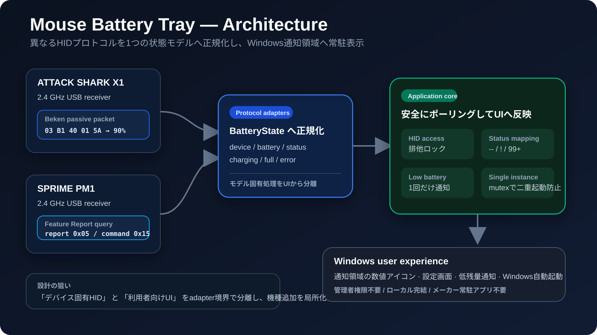
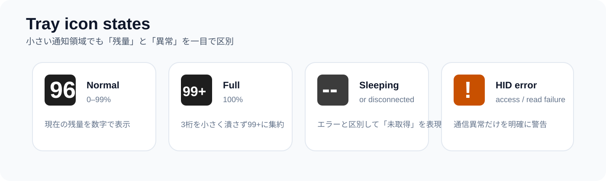
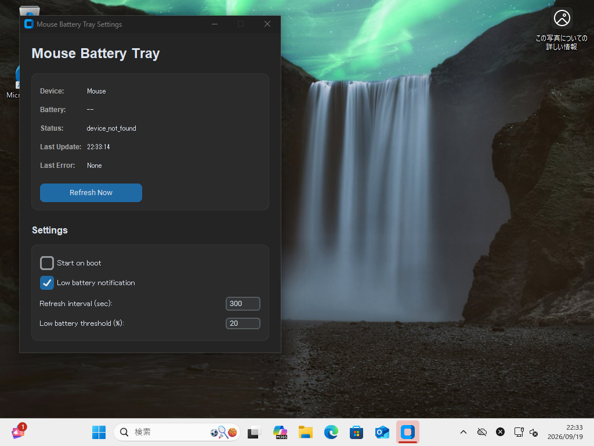
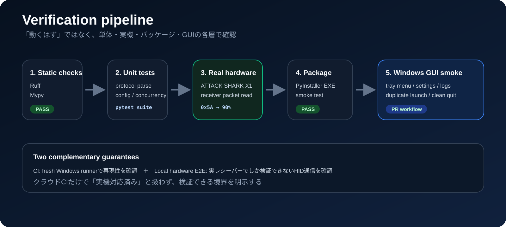

# Mouse Battery Tray

<p align="center">
  <strong>Windowsの通知領域に、ワイヤレスマウスのバッテリー残量を数字で常駐表示する軽量ユーティリティ</strong>
</p>

<p align="center">
  <a href="https://github.com/misaka310/mouse-battery-tray/actions/workflows/build-windows.yml"></a>
  
  
  <a href="./LICENSE"></a>
</p>

メーカー公式アプリを常駐させなくても、2.4 GHzレシーバーからHID情報を読み取り、バッテリー残量・スリープ・通信異常を小さなトレイアイコンへ集約します。現行版は **ATTACK SHARK X1** を対象にし、デバイス固有処理をprotocol adapterへ閉じ込め、UI側は共通の状態モデルだけを見る構成です。

> **非公式・非提携**
> このプロジェクトは独立して開発した非公式ツールです。ATTACK SHARK、SPRIMEその他の各社とは提携していません。製品名・サービス名・商標は各権利者に帰属します。

<p align="center">
  
</p>

## What this project demonstrates

- **HID protocol integration** — 同じ「バッテリー残量」でも異なるUSB/HID取得方式をadapter境界で吸収
- **実機リバースエンジニアリング** — ATTACK SHARK X1の実レシーバーからendpointと受信packetを確認して実装
- **利用者向けエラー設計** — 「スリープ/未取得」と「通信失敗」を `--` / `!` で分離
- **Windows常駐アプリ設計** — notification area、低残量通知、single-instance、ユーザー権限だけの自動起動
- **検証境界の明示** — CIで再現できる検証と、実機が必要なHID E2Eを混同しない

## Tray states

<p align="center">
  
</p>

| 表示 | 意味 |
|---|---|
| `0`–`99` | 接続中のバッテリー残量 |
| `99+` | 100% |
| `--` | 未接続、スリープ中、またはbattery packet待ち |
| `!` | HID access / read error |

充電中は緑、低残量時は赤、通常時は高コントラストな濃色背景で表示します。

## Verified Settings UI

<p align="center">
  
</p>

この画面は **Hyper-Vの隔離VM `GUI-CI-01`** で、packaged EXEを `--show-settings` 付きで起動して取得した実スクリーンショットです。マウス/キーボード入力注入は使わず、Settings windowの可視性、single-instance、packaged smoke、証跡保存、`gui-clean` への復元まで中央GUI CIで確認しています。詳細は [Hyper-V GUI acceptance evidence](docs/verification/2026-09-19-hyperv-gui-ci.md) を参照してください。

## Supported devices

| Model | Connection | Verification | Battery transport |
|---|---|---|---|
| **ATTACK SHARK X1** | 2.4 GHz USB receiver | 実機確認済み (2026-09-19) | Beken-family passive HID packet |

### ATTACK SHARK X1 — verified hardware path

確認したレシーバーは `VID 0x1D57 / PID 0xFA60`、battery endpointは `interface 2 / usage page 0x0A` です。実機で受信したpacket:

```text
03 B1 40 01 5A
│  │  │  │  └─ battery = 0x5A = 90
│  │  │  └──── subtype
│  │  └─────── battery report type 0x40
│  └────────── device id 0xB1 = ATTACK SHARK X1
└───────────── report prefix 0x03
```

### Archived: SPRIME PM1

SPRIME PM1対応は2026-09-19に現行runtimeから退役しました。最後のPM1対応コード・テスト・protocol notesは [`archive/sprime-pm1-final`](../../tree/archive/sprime-pm1-final) ブランチに保存しています。現行版の対応機種には含めません。

詳細は [HID protocol notes](docs/protocol-notes.md) を参照してください。

## Architecture

アプリ本体はdevice固有処理を直接扱いません。`battery_reader` が各adapterを順に解決し、共通のbattery resultへ正規化してから、polling・通知・tray renderingへ渡します。

```text
ATTACK SHARK X1 ── attack_shark.py ── battery_reader.py
                                                │
                                                ▼
                                      normalized battery state
                                                │
                          ┌─────────────────────┼────────────────────┐
                          ▼                     ▼                    ▼
                    tray icon            settings UI        low battery alert
```

設計意図・スレッド境界・startup/single-instanceを含む詳細は [Architecture](docs/architecture.md) にまとめています。

## Reliability and verification

<p align="center">
  
</p>

2026-09-19のX1実機受入では、unit tests、実レシーバー読み取り、PyInstaller build、生成EXEのsmoke testを同じ作業で通し、生成EXE自身が `ATTACK SHARK X1 / 90%` を取得するところまで確認しました。加えて、隔離Hyper-V VMでpackaged EXEのSettings表示とsingle-instanceを、入力注入なしで受入確認しています。

品質確認は次の層に分けています。

| Layer | What it proves |
|---|---|
| Ruff / Mypy | import、型境界、明らかな実装不備 |
| Unit tests | X1 packet parse、設定、icon、polling concurrency |
| Real-device probe | 実際のUSB receiver/HID stackから取得できること |
| Packaged smoke | PyInstaller後のEXEでもimport・HID・UI初期化が成立すること |
| Isolated Hyper-V GUI acceptance | `GUI-CI-01`でpackaged EXE、Settings可視性、single-instance、screenshot、clean restoreを入力注入なしで確認 |

クラウドCIにはUSB実機がないため、**hardware compatibilityはローカル実機E2Eでのみ「確認済み」と扱います**。GUI検証の安全境界は [Windows GUI verification](docs/windows-gui-testing.md) に記載しています。実ホスト上の入力注入は行いません。

## Features

- 対応マウスの自動判別
- 32×32 numeric tray icon
- 充電・低残量・未接続・通信異常の視覚的な区別
- pollingとmanual refreshのHIDアクセス直列化
- configurable refresh interval / low battery threshold
- Windows low-battery notification
- Start with Windows (`HKCU\...\Run`, admin不要)
- Windows mutexによるsingle-instance
- 旧SPRIME PM1版configからのmigration

## Requirements

- Windows 10 / 11
- Python 3.10+（source実行・build時）
- 対応する2.4 GHz USB receiver
- 通常利用・自動起動とも管理者権限は不要

## Setup

```powershell
git clone https://github.com/misaka310/mouse-battery-tray.git
cd mouse-battery-tray
powershell -NoProfile -ExecutionPolicy Bypass -File .\scripts\setup.ps1
```

## Usage

2.4 GHz receiverを接続し、マウスがsleep中なら一度動かしてから起動します。

```powershell
.\run.ps1
```

通知領域の数値アイコンから現在値を確認でき、Settingsでは更新間隔、低残量閾値、通知、自動起動を変更できます。設定は `%APPDATA%\MouseBatteryTray\config.json` に保存されます。安全な設定例は [config.example.json](config.example.json) を参照してください。

### Build a standalone EXE

```powershell
powershell -NoProfile -ExecutionPolicy Bypass -File .\scripts\build.ps1
```

生成物:

```text
dist/
└── Mouse-Battery-Tray/
    └── Mouse-Battery-Tray.exe
```

ユーザー環境へ配置し、Windows検索と自動起動まで設定する場合:

```powershell
powershell -NoProfile -ExecutionPolicy Bypass -File .\scripts\install_user.ps1 -EnableStartup
```

管理者権限は不要です。

## Development

```powershell
$env:PYTHONPATH = "src"
.\.venv\Scripts\python.exe -m ruff check src tests
.\.venv\Scripts\python.exe -m pytest tests
.\.venv\Scripts\python.exe scripts\check_real_device.py
powershell -NoProfile -ExecutionPolicy Bypass -File .\scripts\e2e.ps1
```

詳しくは [Development & verification](docs/development.md) を参照してください。

## Project structure

```text
src/mouse_battery_tray/
├── attack_shark.py      # Beken-family packet adapter
├── battery_reader.py    # protocol selection / normalized result
├── app.py               # polling, queue, notification-area lifecycle
├── icon_renderer.py     # 32x32 tray state renderer
├── settings_window.py   # settings/status UI
├── startup.py           # HKCU Run integration
└── single_instance.py   # Windows mutex

tests/
├── test_attack_shark.py
├── test_no_input_injection.py
├── test_polling_concurrency.py
└── Invoke-HyperVGuiCi.ps1  # isolated VM acceptance entrypoint

docs/
├── architecture.md
├── protocol-notes.md
├── development.md
├── windows-gui-testing.md
├── verification/
└── images/
```

## Limitations

- SPRIME PM1の現行サポートは終了しています。必要な旧実装は `archive/sprime-pm1-final` ブランチに保存しています。
- ATTACK SHARK X1は**2.4 GHz receiver接続**で確認しています。Bluetoothは対象外です。
- 同一製品名でもreceiver / firmware / revision差でHID識別子やpacket形式が異なる可能性があります。
- メーカー公式設定ソフトがendpointを排他的に使用している場合、一時的に `!` になることがあります。
- receiverは見えていてもsleep中にbattery heartbeatが来ない場合は `--` とし、通信errorとは区別します。

## Contributing / security

- 機種追加や不具合報告: [CONTRIBUTING.md](CONTRIBUTING.md)
- セキュリティ上の報告: [SECURITY.md](SECURITY.md)
- 外部実装の参照・ライセンス表記: [THIRD_PARTY_NOTICES.md](THIRD_PARTY_NOTICES.md)

## Acknowledgements

ATTACK SHARK / Beken-familyのpacket解析では、MIT Licenseで公開されている [incconutwo/mouse-battery-tray](https://github.com/incconutwo/mouse-battery-tray) の既存実装を参照しました。本リポジトリではATTACK SHARK X1実機の `device id 0xB1` とbattery packetを追加確認しています。

## License

このリポジトリのコードは [MIT License](LICENSE) です。第三者実装・製品名・商標については [THIRD_PARTY_NOTICES.md](THIRD_PARTY_NOTICES.md) も参照してください。
